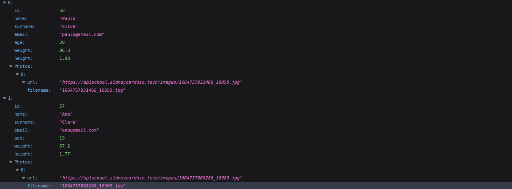
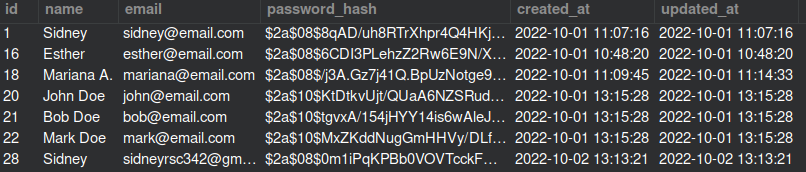

# API DE DADOS ESCOLARES

Esta é uma API desenvolvida com propósito educacional proposta por <a href="https://github.com/luizomf" target="_blank">@luizomf</a>.


## Possibilidades da api

Com esta API nós temos a possibilidade de:

- Fazer login
- Criar usuários (Não aberto ao público por enquanto)
- Criar, deletar e editar alunos (Desde que esteja logado)
- Editar email e senha do usuário
- Fazer uploads de imagens dos alunos

## Segurança implementada

Tabela de usuários com um hash de senha gerado para sua segurança


Foram implementados os seguintes recursos

- Geração de token de segurança com JWT (JsonWebToken)
- "Criptografia" da senha de um usuário utilizando bcryptjs
- Tempo limitado de uso de token para maior segurança

## Tecnologias usadas

- MariaDB
- MySQL
- NodeJS
- Docker

## Clonando o repositório

```sh
git clone https://github.com/sidney-cardoso/api_school.git

cd api_school

code .
```

## instalando


### Com npm
```sh
npm install # Para instalar as dependências

npm run dev # Para rodar a aplicação sem precisar fazer build


npm run build # Para gerar a pasta dist com o código pronto para Produção

npm start # Para iniciar um servidor local
```

### Com yarn
```sh
yarn # Para instalar as dependências

yarn run dev # Para rodar a aplicação sem precisar fazer build

yarn run build # Para gerar a pasta dist com o código pronto para Produção

yarn start # Para iniciar um servidor local

```


:construction: Em desenvolvimento :construction:
